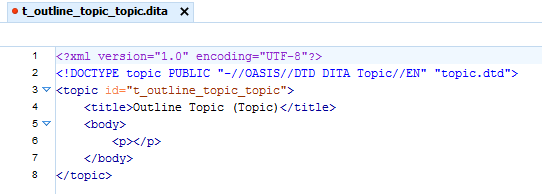
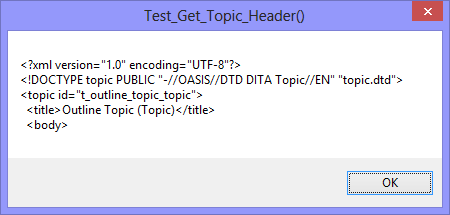

The VBA function ``Get_Topic_Header()`` returns a string containing the customised header-text of a DITA XML **TOPIC** topic-type. It is easily extendable to return the customised header-text of any DITA XML topic-type.

<table border="0">
  <tr>
    <td>&lt;oXygen/&gt; XML Author</td>
    <td><tt>Get_Topic_Header("Topic", "Outline Topic (Topic)")</tt></td>
  </tr>
  <tr>
    <td></td>
    <td></td>
  </tr>
</table>
