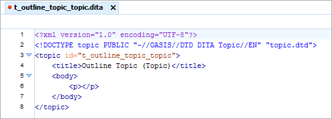

Outline topics as created by &lt;oXygen/&gt; XML Author, and VBA function ``Get_Topic_Header()``.

**Topic (Topic)**
<table border="0">
  <tr>
    <td>&lt;oXygen/&gt; XML Author</td>
    <td><tt>Get_Topic_Header("Topic", "Outline Topic (Topic)")</tt></td>
  </tr>
  <tr>
    <td></td>
    <td></td>
  </tr>
</table>
