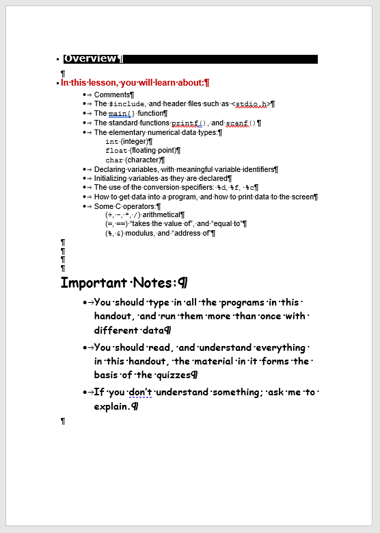
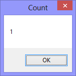

The *main* problem with converting legacy Word documents into any other format, is that the underlying document (what you can't see or get access to) is often 'messed up'. For example, if you look at the ``(1) Overview`` document, you'll have no-doubt about it having two bulleted lists.



However, if you run:

```
Sub Count_Lists()
  MsgBox ActiveDocument.Lists.Count, , "Count"
End Sub
```

It will report only one list:



**Conclusion** It's unlikely that we can rely on simple VBA sub-procedures to automatically convert legacy Word documents into valid DITA XML files, and that some kind of semi-automatic, interventionist process will likely be neccessary.
