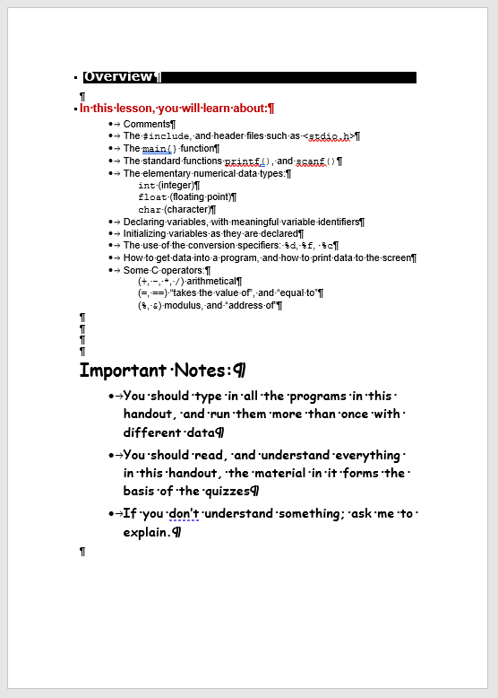
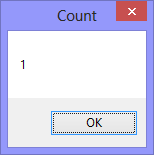

The *main* problem with converting legacy Word documents into any other format, is that the underlying document (what you can't see or get access to) is often 'messed up'. For example, if you look at the ``(1) Overview.docx`` document, you'll have no-doubt about it having two bulleted lists.



However, if you run:

```
Sub Count_Lists()
  MsgBox ActiveDocument.Lists.Count, , "Count"
End Sub
```

It will report only one list:



**Conclusions:** 

* It's unlikely that we can rely on simple VBA sub-procedures to automatically convert legacy Word documents into valid DITA XML files

* Some kind of semi-automatic, ad-hoc, interventionist, process will likely be neccessary - for example - selecting a few paragraphs and running a specific sub-procedure over them

### Solution

* Run the ``main()`` sub-procedure in ``topic_overview.bas``
* Then:
  * Select the first sub-list
  * Run the ``Make_Selected_SubList()`` sub-procedure
  * Select the second sub-list
  * Run the ``Make_Selected_SubList()`` sub-procedure
  * Select the first list
  * Run the ``Make_Selected_UnorderedList()`` sub-procedure
  * Select the second list
  * Run the ``Make_Selected_UnorderedList()`` sub-procedure
  * Select the paragraphs between the ``<body>`` and ``</body>`` elements
  * Run the ``Make_Selected_Section()`` sub-procedure
  * Select the "Important Notes:" paragraph
  * Run the ``Make_Selected_Paragraph()`` sub-procedure

**That should produce an almost-correct DITA XML topic file - that needs a light-edit to make it correct.**  
